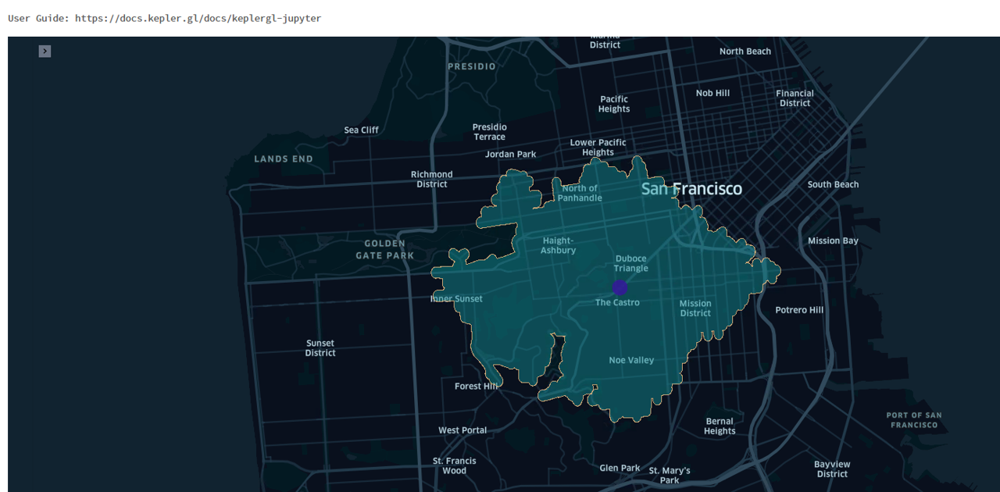

# OSRM-Isochrones [Databricks only] 

**The OSRM is one of the best routing engines contributions to the OpenStreetMap community.**

Over the years whenever we needed to create isochrones for various geospatial use case, we had to rely on other projects that would differ in the output what is reachable compared to OSRM. Then Databricks released [Mosaic](https://www.databricks.com/blog/2022/05/02/high-scale-geospatial-processing-with-mosaic.html) and 
[how to set-up/deploy OSRM backend sever](https://www.databricks.com/solutions/accelerators/scalable-route-generation). 
This immediately led us to start thinking how we could add the ability to create isochrones directly using OSRM engine so the community can take more advantage of a scalable data analytics infrastructure like Databricks.

**OSRM-Isochrones** for Databricks is a PySpark library for creating geometric polygons that represent the areas that can be reached within a specified amount of time from a given starting point, using a particular mode of transportation and a set of travel conditions. It is built on top of several libraries and more importantly integrated to take advantage of Databricks Mosaic functions 

Current supported modes of transport are Walking, Car, Cycle by the following below parameters

## TABLE  
|Variable Names   |	Description           |	MOSCOW     |	Possible Values            |
|--------------   |-----------------------|------------|-------------------------------|
|Mode_of_Transport|	Mode of transport	|Yes	|driving-car, foot-walking,  cycling-regular|
|Direction|	Type of journey either arrival (to) or departure (from) the location|	Yes	|Arrival/departure (Default Value Departure)|
|Travel_Catchment|	Isoline range value. For an isochrone time in minutes|	Yes|	Travel duration in minutes

Note: We are planning to release a non-Databricks version of the library that may benefit the wider geospatial community. IsoDistance is also on the roadmap. Please visit the roadmap to see future releases.  

## Main Features
   * Generate isochrones from a point of location with valid coordinates for a certain duration by mode of transport and direction [arrival/departure]
 
  #### Other Features
  * Setup guide how to install OSRM Table API on Databricks 
  
  

## Examples


```
(for basic examples see also link pynb file)

*  explain

```python
```

* The output isolines/isochroones are based on a **

```python
xxxx
```

