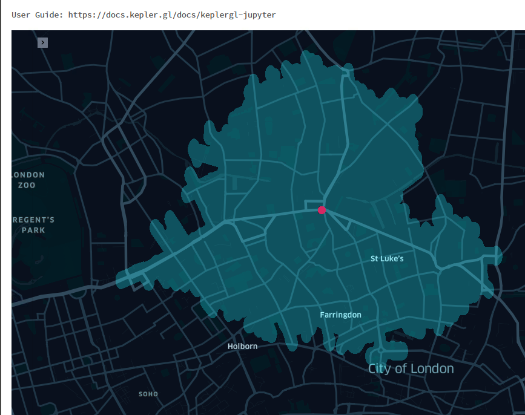

# Isolines

**Isolines / Isochrones using OSM street network data**

Create Isolines and Isochrones for street networks.

**Isolines** is a Python library for creating street networks isochrones (equal-time) polygons with just one line of code. It is built on top of Shapely,
geopandas and mosaic.

**Isolines** allows you to create isolines:
from OSM data **use your own data**: your own network and source locations

## Main Features
   * Generation of Isochroones for a given point location
   * Source location should be provided with the valid coordinates
 
  #### Other Features
  * Generation of isochrones using osrm server which is deployed local  / databricks.
  * Extract the data and store in the table.
  * Extraction of the augmented output graph
  

## Examples


```
(for basic examples see also link pynb file)

*  explain

```python
```

* The output isolines/isochroones are based on a **

```python
xxxx
```

